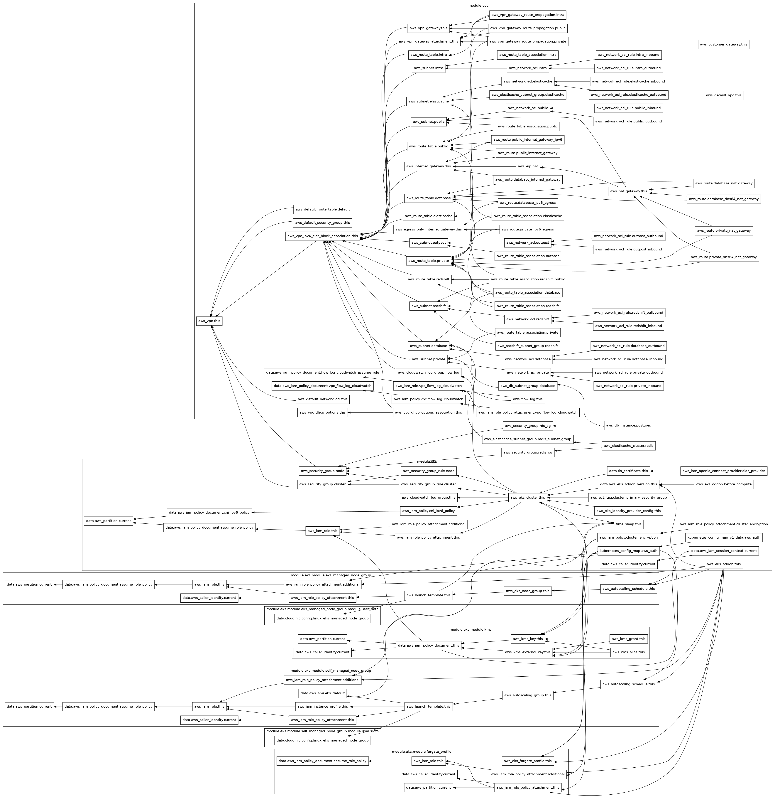

## Reliability-First Cloud Platform (AWS EKS + GitOps + Observability)
An end-to-end, production-ready cloud infrastructure designed for high availability and deep observability. This platform leverages Infrastructure as Code (IaC) to provision a resilient environment on AWS, featuring a self-healing microservice architecture.

### System Architecture


graph TD
    %% Main Resources
    aws_db_instance.postgres --> aws_security_group.rds_sg
    aws_db_instance.postgres --> module.vpc.aws_db_subnet_group.database
    aws_elasticache_cluster.redis --> aws_elasticache_subnet_group.redis_subnet_group
    aws_elasticache_cluster.redis --> aws_security_group.redis_sg
    aws_elasticache_subnet_group.redis_subnet_group --> module.vpc.aws_subnet.database
    aws_security_group.rds_sg --> module.eks.aws_security_group.node
    aws_security_group.redis_sg --> module.eks.aws_security_group.node
```
    subgraph "module.eks"
        module.eks.aws_eks_cluster.this --> module.eks.aws_cloudwatch_log_group.this
        module.eks.aws_eks_cluster.this --> module.eks.aws_iam_policy.cni_ipv6_policy
        module.eks.aws_eks_cluster.this --> module.eks.aws_iam_role_policy_attachment.this
        module.eks.aws_eks_cluster.this --> module.eks.aws_security_group_rule.cluster
        module.eks.aws_eks_cluster.this --> module.eks.aws_security_group_rule.node
        module.eks.aws_iam_openid_connect_provider.oidc_provider --> module.eks.data.tls_certificate.this
        module.eks.aws_iam_policy.cluster_encryption --> module.eks.module.kms.aws_kms_key.this
        module.eks.aws_iam_role.this --> module.eks.data.aws_iam_policy_document.assume_role_policy
        module.eks.aws_security_group.cluster --> module.vpc.aws_vpc.this
        module.eks.aws_security_group.node --> module.vpc.aws_vpc.this
    end

    subgraph "module.eks.module.eks_managed_node_group"
        module.eks.module.eks_managed_node_group.aws_eks_node_group.this --> module.eks.aws_eks_cluster.this
        module.eks.module.eks_managed_node_group.aws_launch_template.this --> module.eks.aws_security_group.node
    end

    subgraph "module.vpc"
        module.vpc.aws_nat_gateway.this --> module.vpc.aws_eip.nat
        module.vpc.aws_internet_gateway.this --> module.vpc.aws_vpc.this
        module.vpc.aws_subnet.private --> module.vpc.aws_route_table.private
        module.vpc.aws_subnet.public --> module.vpc.aws_route_table.public
    end

    %% Key Dependencies
    module.eks.aws_eks_cluster.this --> module.vpc.aws_subnet.private
    module.eks.kubernetes_config_map.aws_auth --> module.eks.module.eks_managed_node_group.aws_iam_role.this
```
    
    
The full architecture includes a Multi-AZ VPC, managed RDS/Redis, and an EKS cluster with optimized pod density.

**Cloud Provider**: AWS (VPC, EKS, RDS, ElastiCache, IAM)

**Provisioning**: Terraform (IaC)

**Orchestration**: Kubernetes (Amazon EKS)

**Deployment**: ArgoCD (GitOps Workflow)

**Application**: FastAPI (Python 3.11)

**Observability**: Prometheus Operator & Grafana

### Key Features
1. **GitOps CD Workflow**
Using ArgoCD, the platform follows a strict GitOps model. Any changes pushed to the /k8s directory in GitHub are automatically synchronized with the EKS cluster, ensuring zero drift between code and production.

2. **Self-Healing & Resiliency**
The application is configured with replicas: 3 and native Kubernetes liveness probes. During testing, manual pod terminations resulted in instantaneous recovery with zero downtime, as managed by the Kubernetes ReplicaSet controller.

3. **Deep Observability**
The FastAPI application is instrumented to export real-time metrics. A custom Grafana dashboard tracks:

**Traffic**: Total requests and Requests Per Second (RPS).

**Latency**: Average and P99 response times.

**Errors**: HTTP 2xx/4xx/5xx error rates.

**Saturation**: CPU and Memory utilization per pod.

### Technical Challenges & Solutions
**The "Pod Density" hurdle**
* Problem: On t3.small nodes, the default ENI limit capped pod capacity at 11 per node, preventing the heavy Prometheus stack from scheduling.
* Solution: Implemented VPC Prefix Delegation and scaled the node group to 4 managed nodes to provide enough IP headroom for the monitoring stack and application.

**Persistent Storage for Metrics**
* Problem: Prometheus requires persistent storage to keep metric history across restarts.
* Solution: Configured the AWS EBS CSI Driver with appropriate IAM OpenID Connect (OIDC) roles to allow dynamic provisioning of EBS volumes as PersistentVolumeClaims (PVCs).

### Proof of Life
* API Response


*Confirmed connection between FastAPI, RDS Postgres, and ElastiCache Redis.*

* ArgoCD Synchronization


* Grafana Metrics


.


### How to Run (Local)
**Infrastructure**: 
```
cd terraform && terraform apply
```

**Access EKS**: 
```
aws eks update-kubeconfig --name reliability-cluster
```

**Metrics**: 
```
helm install monitoring prometheus-community/kube-prometheus-stack
```
